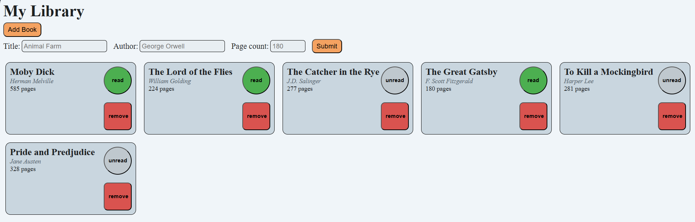

# Library

A personal library app built using HTML, CSS, and JavaScript. Users can add books, mark them as read/unread, and remove them from their collection. 

This project is part of [The Odin Project's Full Stack Javascript path](https://www.theodinproject.com/paths/full-stack-javascript) and focuses on practicing objects and constructors.

## Screenshot


## Features
- Add new books with title, author, and page count
- Toggle read/unread status of the book
- Remove books from the library
- Data is stored using a simple JavaScript array. Library is not persistent across page reloads. 

## Technologies
- HTML
- CSS (Grid, Flexbox, custom styling)
- JavaScript

## Installation
1. Clone the repository
2. Navigate to the project folder: ```cd library```
3. Open index.html in any modern browser

## Live Demo
A live demo is available here: [Library App](https://keegan-george.github.io/library/)